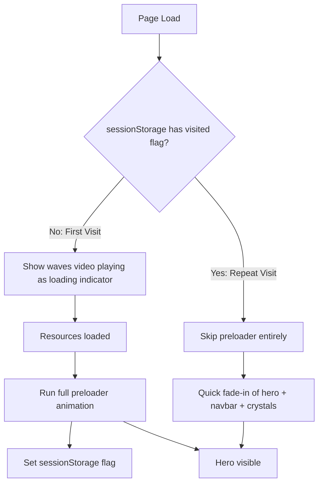

# Smart Preloader: Skip on Cached Visits, Waves as Loading Indicator

## Current Architecture

The loading flow is entirely time-based — a hardcoded `setTimeout(1000)` in `GsapAnimations.tsx` fires the full preloader timeline regardless of whether resources are cached. Three layers are involved:

1. `**LoaderAnimation**` — canvas-based bar animation (z-index 4), self-contained GSAP timeline
2. `**Preloader**` — the name reveal / slide-up preloader page (z-index 3), driven by `GsapAnimations`
3. `**BackgroundWaves**` — the waves.mp4 video background (behind everything)

## Strategy




## Changes

### 1. Add a `usePreloaderState` hook or inline logic in `GsapAnimations.tsx`

- On mount, check `sessionStorage.getItem('preloaderSeen')`.
- **If set (repeat visit)**: immediately hide all preloader elements (`preloader-page-wrapper`, `preloader-wrapper`, `#preloader_image`, `#preloader_cover`), remove `no-click` from page-wrapper, and run only a quick ~0.3s fade-in for the hero, navbar, and crystals. Skip the 1000ms setTimeout entirely.
- **If not set (first visit)**: proceed with the current preloader flow, but instead of a blind 1000ms timeout, wait for actual readiness (see next point). After the preloader completes, set `sessionStorage.setItem('preloaderSeen', '1')`.

### 2. Replace the hardcoded 1000ms timeout with resource-readiness detection in `GsapAnimations.tsx`

Instead of `setTimeout(1000)`, wait for the page to actually be ready:

```javascript
function waitForReady(): Promise<void> {
  return new Promise((resolve) => {
    if (document.readyState === 'complete') return resolve();
    window.addEventListener('load', () => resolve(), { once: true });
  });
}
```

The `LoaderAnimation` canvas (waves bars) is already playing during this wait, so the user sees animated bars while resources load. Once ready, fire the main GSAP timeline.

### 3. Make the BackgroundWaves video visible during loading (first visit)

Currently `BackgroundWaves` is hidden until the GSAP timeline reveals it (`from bgWavesWrapper, { height: '0%' }`). For first visits, show the waves video at full height immediately behind the `LoaderAnimation` canvas. When the canvas fades out (at ~3.6s in LoaderAnimation's timeline), the waves are already visible underneath. Then the main GSAP timeline slides in the preloader page on top.

This means changing the `bgWavesWrapper` initial state: instead of starting at `height: 0`, start at full height. The GSAP `from` tween that reveals it becomes unnecessary for first visits (waves are already showing). For the transition into the hero, the waves are already there.

### 4. Files to modify

- `**[components/GsapAnimations.tsx](components/GsapAnimations.tsx)**`: Add sessionStorage check, split into cached/uncached paths, replace setTimeout with readiness-based trigger
- `**[components/LoaderAnimation.tsx](components/LoaderAnimation.tsx)**`: No changes needed (it already self-manages its timeline and fades out)
- `**[components/Preloader.tsx](components/Preloader.tsx)**`: No structural changes; visibility controlled by GsapAnimations
- `**[components/BackgroundWaves.tsx](components/BackgroundWaves.tsx)**`: No changes needed
- `**[app/globals.css](app/globals.css)**`: May need a `.preloader-skip` utility class to instantly hide preloader elements via CSS (avoids flash)

